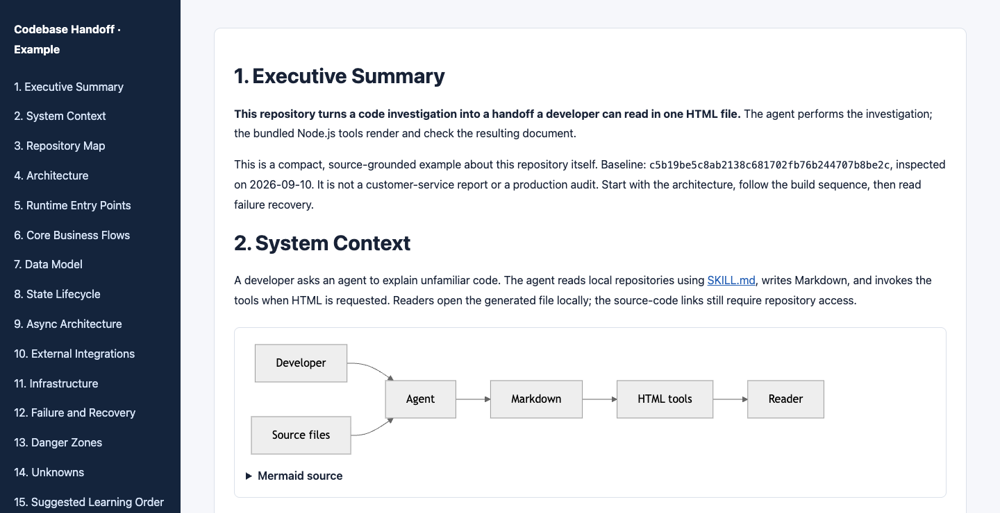
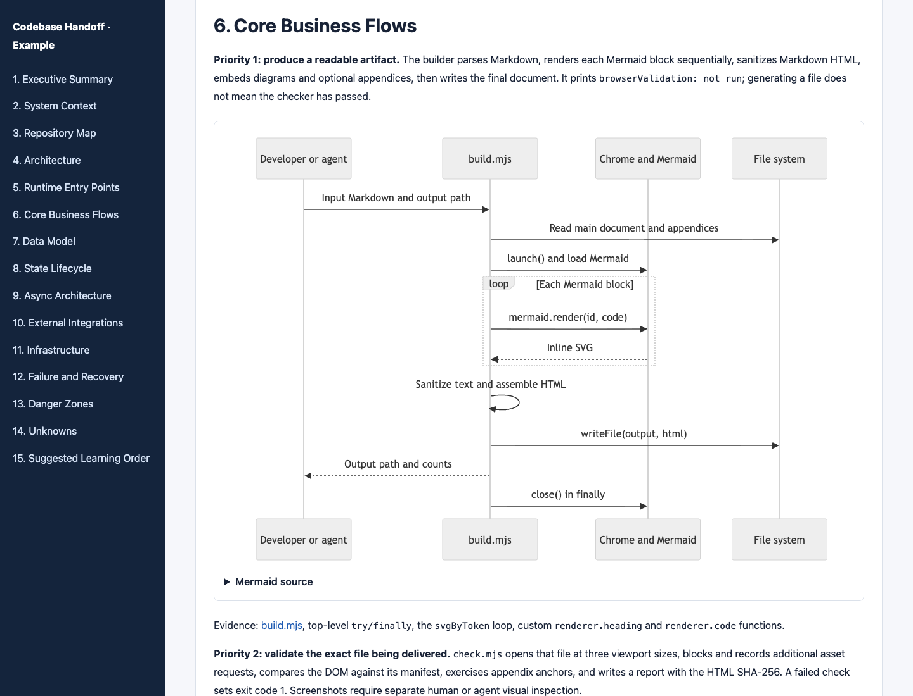
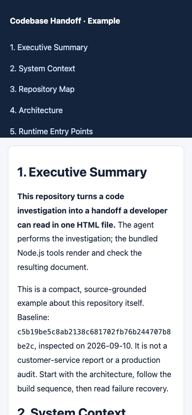

# Codebase Handoff

**Understand where a feature starts, what a change affects, and where to investigate a failure.**

An agent skill for developers inheriting an unfamiliar codebase. It guides the agent through real entrypoints, dependencies, data writes and failure paths, then produces an editable Markdown map and a single offline HTML reader.

## See the output



This is an actual browser capture of the bundled renderer's output, not a design mockup. The example analyzes **this repository's HTML tools** at a recorded source revision. It uses Mermaid; Archify is optional and is not used in this example.

**[Read the example Markdown](examples/CODEBASE_MAP.md) · [Download the example HTML](https://raw.githubusercontent.com/E0min/codebase-handoff/main/examples/CODEBASE_MAP.html) · [View its validation report](examples/validation.json)**

Save the HTML and open it in your browser. Its narrative, diagrams and navigation work offline. Source-code links point to GitHub and need network access when clicked. GitHub's file view shows HTML source rather than running the reader.

### Follow a request through the code



The report connects the trigger, runtime entrypoint, processing steps, data writes and final result. It names the real files and functions at each boundary, then explains failure handling and change impact.

<details>
<summary>Mobile reader preview</summary>



Wide diagrams and tables scroll inside their own containers. The whole page should not overflow horizontally.

</details>

## When to use it

- You are taking over a repository or a service spread across multiple repositories.
- You need to trace a feature before changing its API, data model, integration or asynchronous processing.
- You need a handoff another developer can read independently, including what to check during a failure.

The reader is expected to know programming, but does not need prior knowledge of the service. The workflow adapts to libraries, CLIs, batch programs and web services. Repository count, language and framework are not fixed.

## What you get

| Deliverable | What it helps you do |
| --- | --- |
| `CODEBASE_MAP.html` | Read the explanation, diagrams and necessary appendices in one offline file |
| `CODEBASE_MAP.md` | Edit the narrative and retain the Mermaid source |
| Source references | Check important claims against actual files, symbols and revisions |
| Failure and change-impact tables | Decide where to start debugging or modifying a feature |
| Unknowns and learning order | Know what to ask the previous developer and what to study next |
| Validation report and optional screenshots | Separate automated browser checks from visual review and application testing |

The agent checks 15 areas: executive summary, system context, repository map, architecture, entrypoints, business flows, data model, state lifecycle, asynchronous work, integrations, infrastructure, recovery, danger zones, unknowns and learning order. Small projects can combine related sections; explicit user formatting wins.

## How it works

1. Establish the real repository boundaries and inspected revisions.
2. Map responsibilities and high-level dependencies before reading implementation details.
3. Trace the most important flows through entrypoints, data changes, external calls and asynchronous boundaries.
4. Explain failure paths and the modules affected by a change, with source references.
5. Generate the HTML reader and check the final artifact.

**The agent investigates the code. The scripts render and validate the document.** Running `build.mjs` alone does not discover an architecture or verify the narrative.

README files are discovery aids, not architectural proof. Unverified claims must be labeled as requiring confirmation. The skill distinguishes code inspection, observed execution, code-based risks and unknowns. It does not invent absent layers, treat an enum as proof of a live transition, or call a document check a production test.

## Install

Clone the repository into your agent's skill directory. For Codex:

```sh
git clone https://github.com/E0min/codebase-handoff.git ~/.codex/skills/codebase-handoff
```

For Claude Code:

```sh
git clone https://github.com/E0min/codebase-handoff.git ~/.claude/skills/codebase-handoff
```

If that folder already exists, preserve your local changes before updating it. Alternatively, download the repository and copy the complete folder into your agent's skill directory as `codebase-handoff`. Keep `references/`, `scripts/`, and `agents/` with `SKILL.md`.

- Codex: `~/.codex/skills/codebase-handoff`
- Claude Code: `~/.claude/skills/codebase-handoff`
- Other agents: use the host's documented skill directory or load `SKILL.md` explicitly.

The instructions are host-independent; automatic discovery depends on the host. Start a new session if the host caches its skill catalog. Separate forward execution by every supported host has not been verified.

## Use

```text
Use codebase-handoff to explain this repository to a developer inheriting it.
Start with the system map, then trace the most important data-changing flows.
Produce one offline HTML reader and retain the Markdown source.
```

```text
$codebase-handoff 이 서비스의 결제 기능을 관련 레포까지 연결해서 분석해줘.
핵심 흐름, 데이터 변경, 장애 확인 순서와 변경 영향을 설명해줘.
```

The output follows the reader's language. All 15 analysis areas are checked, while document length and the learning sequence adapt to project size. Explicit user formatting takes precedence. Mermaid is the default. Archify is optional and must be installed separately when requested.

## HTML tools

Analysis and Markdown authoring require no bundled runtime. The optional HTML tools require Node.js 22+ and an existing Chrome/Chromium executable.

From `scripts/`:

```sh
npm ci --ignore-scripts
node build.mjs --input /path/to/CODEBASE_MAP.md --output /path/to/CODEBASE_MAP.html --browser /path/to/chrome
node check.mjs --input /path/to/CODEBASE_MAP.html --report /path/to/validation.json --browser /path/to/chrome --screenshots /path/to/screenshots
```

Alternatively, set `CHROME_PATH`. No browser is downloaded automatically. Repeat `--appendix` to embed supporting Markdown files. Use `--viewer` only with a trusted, self-contained architecture viewer. See [HTML delivery](references/html-delivery.md) for input limitations and validation boundaries.

The renderer embeds Mermaid SVG and local raster images, escapes raw Markdown HTML, and rejects remote images. The checker opens the result at desktop and mobile sizes, blocks and records external/sidecar requests, checks internal anchors and diagram counts, and saves screenshots. Inspect those screenshots separately before claiming visual verification. It does not verify application behavior, production deployment, or source-link destinations.

Run integration tests from `scripts/` with `CHROME_PATH` set:

```sh
npm test
```

Test coverage includes Unicode paths, Markdown appendices, four Mermaid types, embedded viewers, offline assets, unsafe Markdown, malformed diagrams, broken anchors, and external request detection. Browser tests have been run on macOS with Chrome. Linux, Windows, and full task execution across different agent hosts remain unverified.

## Reproduce the preview

From the repository root, with `CHROME_PATH` pointing to your Chrome/Chromium executable:

```sh
npm --prefix scripts ci --ignore-scripts
node scripts/build.mjs --input examples/CODEBASE_MAP.md --output examples/CODEBASE_MAP.html --title "Codebase Handoff · Example" --lang en
node scripts/check.mjs --input examples/CODEBASE_MAP.html --report examples/validation.json --screenshots examples/screenshots
```

The checker captures the overview and first diagram at three viewport sizes. The additional `overview.png` captures the top of the reader at 1440×740, and `core-flow.png` captures section 6 at 1440×1100. Rendering again can change generated SVG identifiers and therefore the artifact hash. The checked-in validation report belongs to the checked-in HTML file.

The preview passes the browser checks at 1440×1000, 1920×1080 and 390×844, with four Mermaid diagrams, no broken internal anchors, no external asset requests and no page-level horizontal overflow. Overview, flow and mobile screenshots were also visually inspected. This is evidence for this example, not a guarantee for every generated handoff.

## Contents

- [SKILL.md](SKILL.md): scope, investigation order, evidence rules, delivery workflow.
- [Analysis contract](references/analysis-contract.md): 15 analysis areas, failure boundaries, learning order.
- [HTML delivery](references/html-delivery.md): single-file reading, tool commands, verification limits.
- `scripts/`: reproducible generation, browser checks, integration tests, pinned dependencies.

Project source code and private handoff documents are not part of this skill package.

## License

[MIT](LICENSE). Installed dependencies retain their own licenses.
