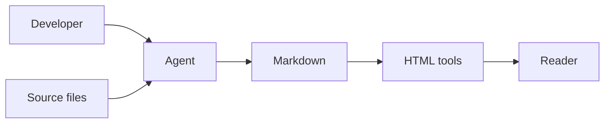
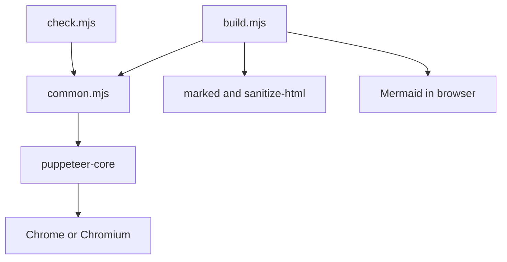
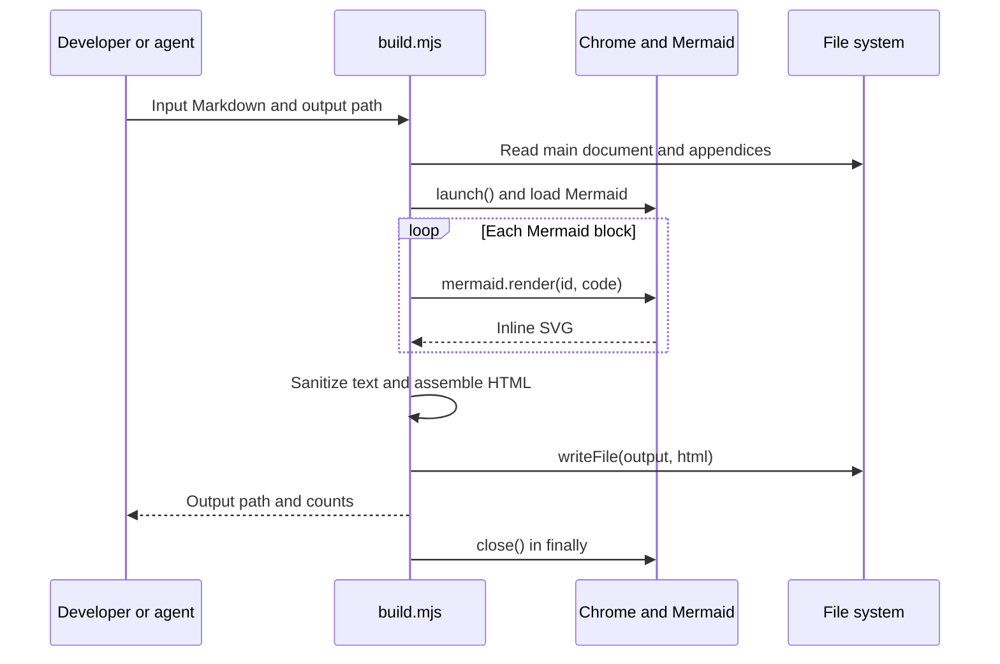
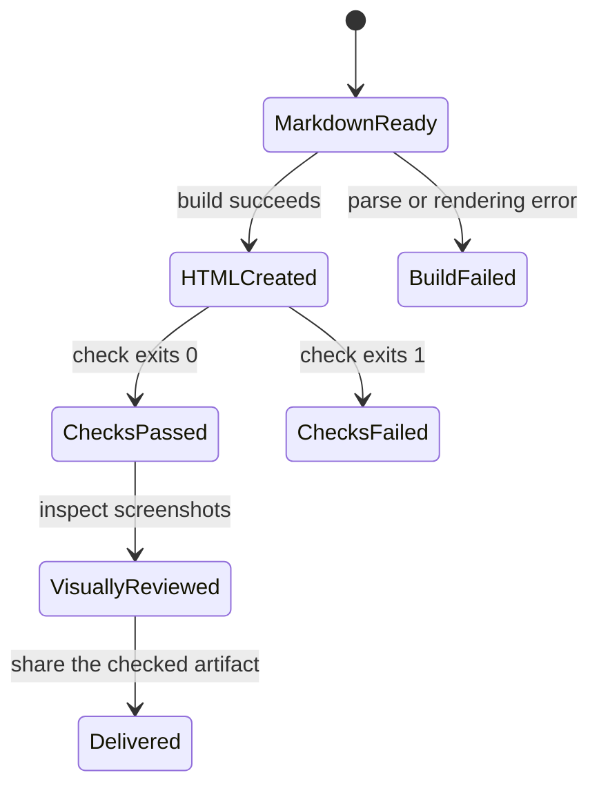

# 1. Executive Summary

**This repository turns a code investigation into a handoff a developer can read in one HTML file.** The agent performs the investigation; the bundled Node.js tools render and check the resulting document.

This is a compact, source-grounded example about this repository itself. Baseline: `c5b19be5c8ab2138c681702fb76b244707b8be2c`, inspected on 2026-09-10. It is not a customer-service report or a production audit. Start with the architecture, follow the build sequence, then read failure recovery.

# 2. System Context

A developer asks an agent to explain unfamiliar code. The agent reads local repositories using [SKILL.md](https://github.com/E0min/codebase-handoff/blob/c5b19be5c8ab2138c681702fb76b244707b8be2c/SKILL.md), writes Markdown, and invokes the tools when HTML is requested. Readers open the generated file locally; the source-code links still require repository access.

# 3. Repository Map

| Path | Responsibility | Priority | Change impact |
| --- | --- | --- | --- |
| `SKILL.md` | Analysis scope, evidence rules, output workflow | Critical | Changes how every handoff is investigated |
| `references/analysis-contract.md` | Fifteen investigation areas | High | Changes coverage and learning guidance |
| `references/html-delivery.md` | Offline delivery and verification contract | High | Changes what counts as a complete HTML handoff |
| `scripts/build.mjs` | Markdown, diagrams and appendices to HTML | Critical | Changes every generated reader |
| `scripts/check.mjs` | Browser checks and verification report | High | Changes which artifacts pass automated checks |
| `scripts/common.mjs` | `options()`, `escape()`, `launch()` | High | Shared by generation and validation |
| `scripts/test.mjs` | End-to-end tool regression cases | High | Detects rendering and rejection regressions |

# 4. Architecture

There is no application server, database or background worker in the bundled tools. They are two CLI entrypoints sharing browser launch and argument handling. Their installed dependencies are declared in [scripts/package.json](https://github.com/E0min/codebase-handoff/blob/c5b19be5c8ab2138c681702fb76b244707b8be2c/scripts/package.json).

`common.mjs` changes affect both commands. HTML IDs and the embedded `handoff-manifest` form a contract between the builder and checker. Dependency centrality was not measured beyond these inspected tool modules.

# 5. Runtime Entry Points

| Entry point | Trigger | Main calls | Purpose |
| --- | --- | --- | --- |
| `scripts/build.mjs` top-level module | `node scripts/build.mjs --input ... --output ...` | `options()`, `launch()`, `marked.lexer()`, `mermaid.render()`, `writeFile()` | Produce the reader |
| `scripts/check.mjs` top-level module | `node scripts/check.mjs --input ... --report ...` | `options()`, `launch()`, `page.goto()`, `page.evaluate()`, `writeFile()` | Check the final artifact |
| `scripts/test.mjs` | `npm test` from `scripts/` | `run()` → child Node.js processes | Exercise both tools |

# 6. Core Business Flows

**Priority 1: produce a readable artifact.** The builder parses Markdown, renders each Mermaid block sequentially, sanitizes Markdown HTML, embeds diagrams and optional appendices, then writes the final document. It prints `browserValidation: not run`; generating a file does not mean the checker has passed.

Evidence: [build.mjs](https://github.com/E0min/codebase-handoff/blob/c5b19be5c8ab2138c681702fb76b244707b8be2c/scripts/build.mjs), top-level `try/finally`, the `svgByToken` loop, custom `renderer.heading` and `renderer.code` functions.

**Priority 2: validate the exact file being delivered.** `check.mjs` opens that file at three viewport sizes, blocks and records additional asset requests, compares the DOM against its manifest, exercises appendix anchors, and writes a report with the HTML SHA-256. A failed check sets exit code 1. Screenshots require separate human or agent visual inspection.

# 7. Data Model

These tools operate on files and in-memory objects, not persistent domain entities.

| Data | Creator | Reader | Source of truth |
| --- | --- | --- | --- |
| Markdown and appendices | Investigating agent or developer | `build.mjs` | Editable narrative and Mermaid source |
| `handoff-manifest` | `build.mjs` | `check.mjs` | Expected rendered counts, not proof of factual correctness |
| HTML file | `build.mjs` | Browser and checker | Specific delivered artifact |
| Validation JSON | `check.mjs` | Developer or agent | Recorded checks bound to an HTML hash |

There is no database schema or entity relationship diagram to invent. The final file write is not an atomic temp-file-and-rename operation; interrupted writes require a rebuild and recheck.

# 8. State Lifecycle

The following states explain the delivery workflow. They are not stored status enum values.

A later edit changes the artifact and invalidates the previous file hash. Re-run validation before treating the modified file as the checked result.

# 9. Async Architecture

`build.mjs` uses `Promise.all()` to read documents and walk tokens, and awaits browser rendering. Mermaid blocks render sequentially because they share browser state. Both tools close the browser in `finally` after a successful launch. These are in-process asynchronous operations; there is no durable queue, scheduler, retry worker or replay mechanism.

# 10. External Integrations

| Dependency | Use | Boundary and failure behavior |
| --- | --- | --- |
| `marked` | Markdown tokens and HTML | Parsing is not a codebase investigation |
| `sanitize-html` | Restrict generated Markdown HTML | Raw Markdown HTML is escaped; unsupported link schemes are removed |
| Mermaid | Produce SVG in Chrome | Strict mode; rendering errors abort generation |
| `puppeteer-core` | Control an existing browser | No browser download; executable must be supplied |
| Optional architecture HTML | Embedded sandbox viewer | Must be trusted and self-contained; not automatically certified as Archify output |

No external API authentication, token refresh or rate-limit handler is implemented by these tools. The checker records and rejects extra asset requests while reading the result. Installation still needs access to package dependencies unless cached.

# 11. Infrastructure

The declared runtime is Node.js 22 or later plus a Chrome/Chromium executable. [common.mjs](https://github.com/E0min/codebase-handoff/blob/c5b19be5c8ab2138c681702fb76b244707b8be2c/scripts/common.mjs) resolves the browser from `--browser` or `CHROME_PATH`, checks accessibility, and launches it headlessly.

The inspected baseline has no CI workflow, container deployment, production service, migration or environment-specific deployment configuration. Dependencies are pinned by `scripts/package-lock.json`. The tools run locally; no hosted reader is deployed by these commands.

# 12. Failure and Recovery

| Symptom | First check | Recovery and limit |
| --- | --- | --- |
| Browser fails to start | `launch()` and executable path | Correct `--browser` or `CHROME_PATH`; no automatic retry |
| Mermaid generation fails | Failing Markdown block and render error | Fix the diagram, rebuild, then check the new file |
| Broken appendix navigation | Relative Markdown link and heading anchor | Correct the source link; rebuild and validate |
| External requests appear | `results[].requests` in the report | Embed or remove the requested asset; blocked loading does not count as offline success |
| Report hash differs from shared HTML | Final artifact SHA-256 | Validate the actual file to be shared |

The tools do not roll back an existing output or validate application behavior. An old output may still exist after an early failed build; the command exit status matters.

# 13. Danger Zones

| Area | Why it matters | Before changing |
| --- | --- | --- |
| Anchor generation and link rewriting | Cross-document navigation depends on both | Check Unicode, duplicates and appendix fragments |
| Sanitization and SVG embedding | Defines executable-content boundaries | Test raw HTML, unsafe links and failed rendering |
| Manifest and checker selectors | A mismatch can cause false validation results | Exercise both correct and deliberately broken artifacts |
| Browser launch and dependency versions | Shared runtime for generation and checks | Run integration tests with an available browser |

# 14. Unknowns

1. **Requires confirmation:** Linux and Windows browser behavior; the published baseline documents macOS Chrome testing only.
2. **Requires confirmation:** Full investigation quality across agent hosts and large multi-repository applications; tool tests do not prove this.
3. **Requires confirmation:** Practical limits for very large documents and complex diagrams; no performance benchmark is declared.

# 15. Suggested Learning Order

| Order | Why read this next | Files | Question you should answer |
| --- | --- | --- | --- |
| 1 | Understand the analysis contract | `SKILL.md`, `references/analysis-contract.md` | What must be supported by source evidence? |
| 2 | Find the runtime boundary | `scripts/common.mjs` | How does the tool find and start a browser? |
| 3 | Trace content and asset handling | `scripts/build.mjs` | Where does Markdown become HTML, and what can execute? |
| 4 | Understand acceptance and failure | `scripts/check.mjs` | What makes a result pass, and what remains unverified? |
| 5 | Review regression coverage | `scripts/test.mjs`, `references/html-delivery.md` | Which failures are exercised before changing the renderer? |
